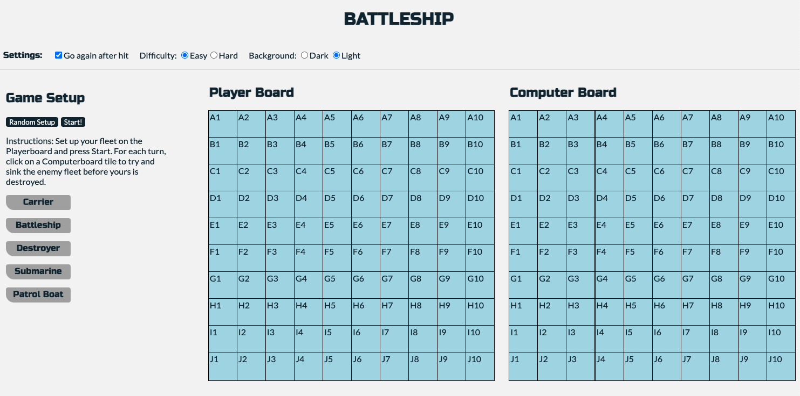

# Battleship Game

This is an early project of mine that is a simplified version of the game "Battleship". The functionality is written entirely in Vanilla JS. Player has the option of choosing Hard or Easy mode (game will detect a "hit" and search in that area vs. game will  pick tiles randomly ). The Player can also toggle light or dark mode and if the player or computer get to go again after a "hit".

## Getting Started

Click [here](https://vigilant-roentgen-7d6c39.netlify.app/) to visit working App

## Future Enhancements

- Add ability for player to set up ships manually
- Smoother gameplay with captains log screen and instructions
- Improve current CSS to incoporate more naval themes
